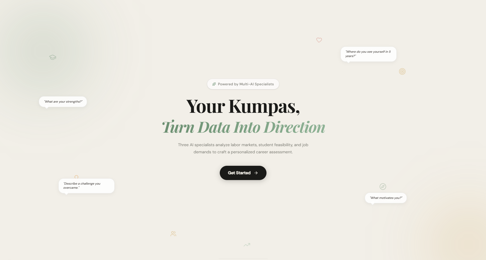

<div align="center">
  

  # Kumpas

  **An explainable multi-agent career alignment system for guidance counselors**

  [](https://nextjs.org/)
  [](https://react.dev/)
  [](https://supabase.com/)
  [](https://ai.google.dev/)
</div>

---

## Overview

Kumpas helps Philippine school guidance counselors turn student academic records and counseling notes into transparent, data-backed career recommendations.

The system is designed for Grade 10 and Senior High School counseling sessions. It combines Form 137, NCAE, NAT, and counselor-encoded session notes with a federated RAG knowledge base covering Philippine labor demand, academic feasibility, scholarship pathways, and program cost signals.

Kumpas is not a replacement for the counselor. It reduces repetitive document review and report preparation so counselors can spend more time guiding students through realistic career decisions.

---

## Application Preview

### Landing Page



*The counselor-facing entry point for starting a career assessment session.*

---

## How It Works

### 1. Intake and Redaction

Counselors upload student academic documents and enter structured session notes across five fields:

- Career Goal
- Personal Interests and Strengths
- Family and Financial Situation
- Concerns and Red Flags
- Counselor's Overall Impression

Uploaded documents pass through server-side PII redaction before downstream AI processing.

### 2. Academic Extraction and Confirmation

Kumpas extracts academic signals from Form 137, NCAE, and NAT records. Counselors review and confirm the extracted profile before any recommendation workflow continues.

### 3. Multi-Agent Analysis

Three specialist agents analyze the approved profile through separate knowledge silos:

| Specialist | Focus | Knowledge Grounding |
|---|---|---|
| Academic Auditor | Academic fit and aptitude signals | Student records and academic evidence |
| Industry Analyst | Labor demand and market viability | PSA OpenSTAT and DOLE BLE labor data |
| Feasibility Strategist | Pathway affordability and access | CHED, TESDA, scholarship, and program-cost data |

The synthesis layer ranks at least three distinct career paths and attaches reasoning, concerns, and source references.

### 4. Explainable Report Generation

Kumpas produces a counselor-facing results page and a downloadable PDF report with:

- Ranked career recommendations
- Academic evidence completeness
- Key signals and reasoning summaries
- Source attribution and ingestion timestamps
- Report download and session completion tracking

### 5. Session Orchestration

Session state, report lifecycle, progress indicators, and retention behavior are managed so the counselor can complete the workflow in a standard browser session.

---

## Technology Stack

| Layer | Technology |
|---|---|
| App Framework | Next.js 16, React 19 |
| Styling and UI | Tailwind CSS, shadcn-style components, lucide-react |
| Authentication | Supabase Auth |
| Database and Vector Store | Supabase Postgres with pgvector |
| AI Processing | Google Gemini API |
| Document Handling | Tesseract.js, PDF parsing utilities, server-side redaction |
| Report Output | Server-side PDF renderer and Supabase Storage signed URLs |
| Ingestion | GitHub Actions and curated data pipelines |

---

## Local Development

Install dependencies:

```bash
npm install
```

Create `.env.local` with the required project secrets:

```bash
NEXT_PUBLIC_SUPABASE_URL=
NEXT_PUBLIC_SUPABASE_ANON_KEY=
SUPABASE_SERVICE_ROLE_KEY=
DOCUMENT_INTAKE_API_KEY=
ACADEMIC_AUDITOR_API_KEY=
INDUSTRY_ANALYST_API_KEY=
FEASIBILITY_STRATEGIST_API_KEY=
SYNTHESIS_API_KEY=
REPORT_RETENTION_SECRET=
```

Start the app:

```bash
npm run dev
```

Open [http://localhost:3000](http://localhost:3000).

---

## Validation

Useful checks:

```bash
npm run lint
npm exec -- tsc --noEmit --pretty false
npm run smoke:module4
```

For report layout verification:

```bash
npx tsx scripts/render-report-fixture.mjs
```

---

## Privacy and Safety

Kumpas is designed around counselor control and data minimization:

- Authentication is required for in-app workflows.
- Student records are treated as personal information under R.A. 10173.
- PII redaction happens before external AI processing.
- Supabase service-role access is restricted to server-side routes and ingestion workflows.
- Generated report PDFs are stored in a private bucket and delivered through short-lived signed URLs.

---

## Documentation

- [Software Requirements Specification](docs/SRS.md)
- [Software Design Description](docs/SDD.md)
- [Ingestion Guide](ingestion/README.md)

---

*Turning data into direction.*
